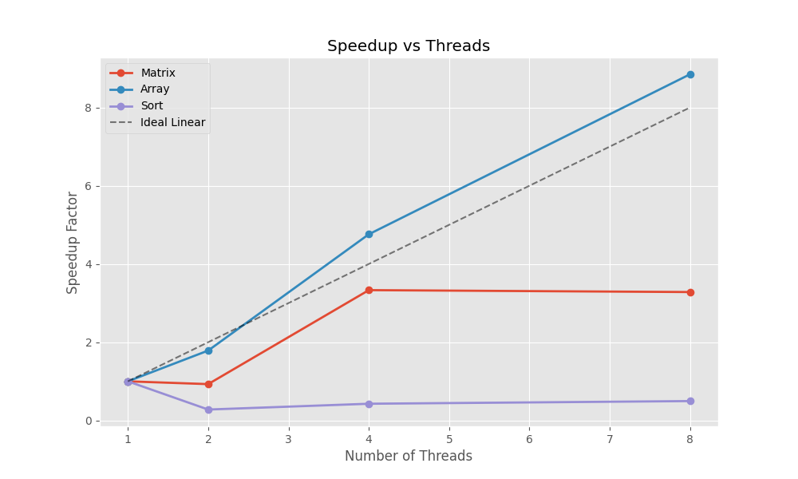
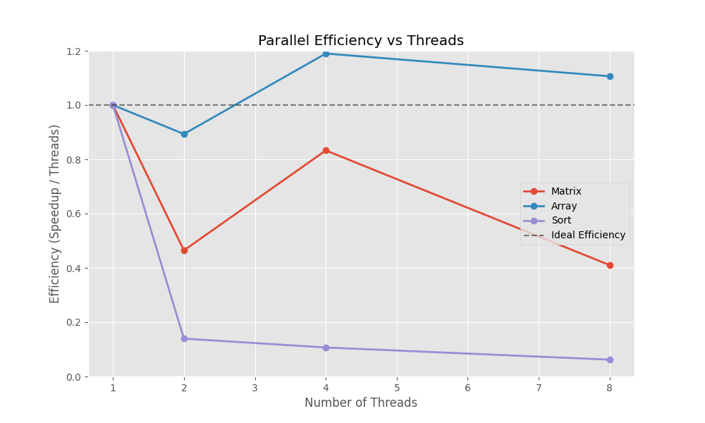
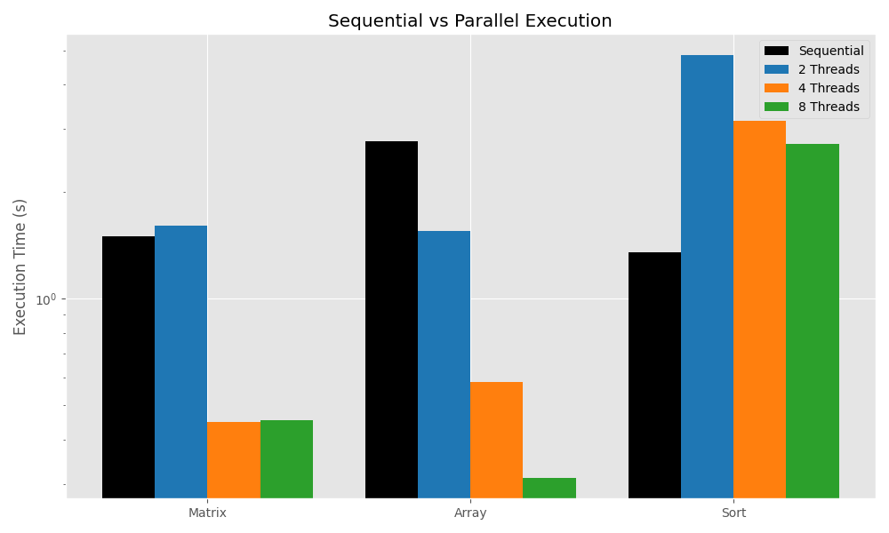
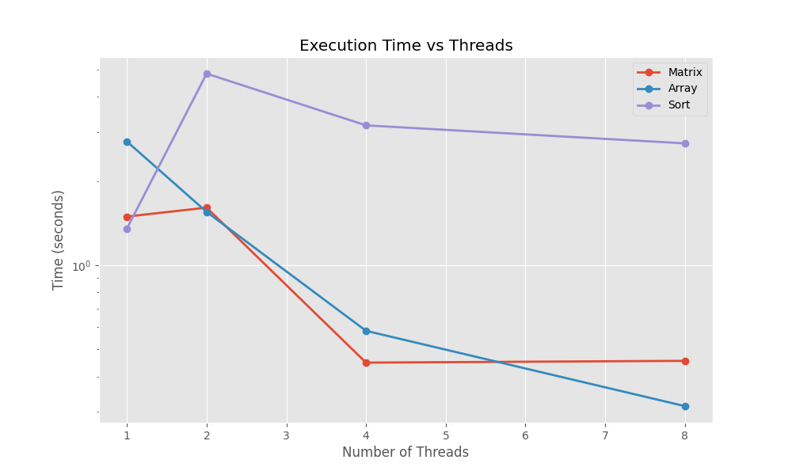

# ⚡ Performance Evaluation of Automatic Parallelization
### Multi-Core CPU Analysis using OpenMP & C++


---

## 📖 Executive Summary
This project investigates the efficiency of **Automatic Parallelization** on modern multicore processors. By converting sequential C++ algorithms into parallel implementations using **OpenMP**, we evaluate scalability, speedup, and memory bottlenecks across different computational patterns.

**Key Objectives:**
* **Quantify Speedup:** Measure how execution time decreases as core count increases.
* **Analyze Efficiency:** Determine how well CPU resources are utilized.
* **Identify Bottlenecks:** Contrast *Compute-Bound* tasks vs. *Memory-Bound* tasks.

---

## 📊 Performance Dashboard
*Visualizing the actual impact of parallel execution from collected data.*

### 1. Speedup & Scalability
> **Insight:** **Array Processing** demonstrated super-linear speedup (>8x), likely due to improved cache locality per core. **Matrix Multiplication** peaked at 4 threads (3.3x) before saturating. **Merge Sort** suffered from task overhead, resulting in performance regression.

| Benchmark | Type | 2 Threads | 4 Threads | 8 Threads | Trend |
| :--- | :--- | :--- | :--- | :--- | :--- |
| **Matrix Mult** | 🧮 Compute |  **0.9x** |  **3.3x** |  **3.3x** | ⚖️ Saturated |
| **Array Proc** | 💾 Memory |  **1.8x** |  **4.8x** |  **8.8x** | 🚀 Super-Linear |
| **Merge Sort** | 🔀 Irregular |  **0.3x** |  **0.4x** |  **0.5x** | 📉 Regression |

<p align="center">
  
  
</p>

---

### 2. Execution Time Analysis
> **Insight:** Parallelization reduced execution time by nearly **90%** for array operations.

| Metric | Sequential (1 Thread) | Parallel (8 Threads) | Improvement |
| :--- | :---: | :---: | :---: |
| **Matrix Multiplication** | `1.49s` | `0.45s` | **~70% Reduction** |
| **Array Processing** | `2.77s` | `0.31s` | **~89% Reduction** |
| **Merge Sort** | `1.35s` | `2.73s` | *Slower (Overhead)* |

<p align="center">
  
  
</p>

---

## 🧠 Performance Model and Theory

The analysis is based on standard metrics from high-performance computing (HPC) to evaluate parallel scalability and resource utilization.

### Speedup

Speedup measures how much faster a parallel program executes compared to its sequential version:

$$
S(p) = \frac{T_1}{T_p}
$$

where:
- $T_1$ is the execution time using a single thread
- $T_p$ is the execution time using $p$ threads

---

### Efficiency

Efficiency measures how effectively the available processing resources are utilized:

$$
E(p) = \frac{S(p)}{p}
$$

Efficiency interpretation:
- **$E(p) \approx 1.0$** → near-ideal scaling with minimal overhead  
- **$E(p) < 1.0$** → performance limited by synchronization, scheduling, or memory bottlenecks  
- **$E(p) > 1.0$** → super-linear speedup, typically caused by cache locality effects  

---

### Amdahl’s Law

Amdahl’s Law defines the theoretical upper bound on achievable speedup:

$$
S_{\text{max}}(p) = \frac{1}{f + \frac{1 - f}{p}}
$$

where:
- $f$ is the fraction of the program that must execute sequentially
- $p$ is the number of parallel threads

Amdahl’s Law assumes fixed memory behavior and uniform execution costs.  
Modern multicore systems violate this assumption due to hierarchical caches and improved data locality, which explains the observed **super-linear speedup** in some benchmarks.


## 🛠 Benchmarks Implemented

| Benchmark | Description | Challenge Addressed |
| :--- | :--- | :--- |
| **Matrix Multiplication** | Standard $O(N^3)$ algorithm. | **Data Dependencies:** Managing nested loops and shared variables. |
| **Array Processing** | 50M element `sin()` calculation. | **Memory Bandwidth:** Stress testing cache coherence and RAM speed. |
| **Merge Sort** | Recursive divide-and-conquer. | **Control Flow:** Handling irregular branching and task parallelism. |

---

## 🚀 How to Run

### Prerequisites
* **Compiler:** G++ (MinGW-w64) with OpenMP support.
* **Analysis:** Python 3.x (with `pandas`, `matplotlib`).

### 1. Automated Execution (Windows)
We provide a single batch script to compile, run, and collect data.
```cmd
scripts\run_benchmarks.bat
